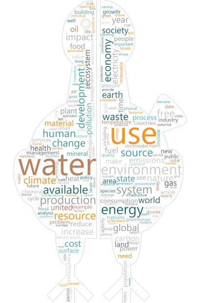

# Word Cloud Python 

The python script takes as input a set of text files, strip them into single words for counting
their frequency and display them graphically in a [tag cloud](https://en.wikipedia.org/wiki/Tag_cloud).

Intermediate language processing (also manual) has been applied to remove irrelevant words, and unify some from same semantic field.

This script has been developed to support the [article](https://thedodoproject.com/what-is-sustanability/) as a part of [the dodo project](www.thedodoproject.com/).

 

<a rel="license" href="http://creativecommons.org/licenses/by-sa/4.0/"></a><br />The images provided in this project are licensed under a <a rel="license" href="http://creativecommons.org/licenses/by-sa/4.0/">Creative Commons Attribution-ShareAlike 4.0 International License</a>.

The source code is licensed under MIT License.

## Project Files 
- `word-count.py`. Python script for cloud tag generation.
- `thedodoproject-logo-icon.png`. Input image for cloud tag mask contourn.
- `results-pre-stem-csv`. Result previous to manual words stemming.
- `results.csv`. Result with most frequent words.  
- `manual-stem.txt`. List of manually grouped words.
- `word-cloud.png`. Output cloud tag image. 

## Required Python Libaries

- Install NLTK:
  ```
  $ pip install nltk
  ```

- Download NLTK packages. From python console:
    ```
    $ python 
    >>> import nltk
    >>> nltk.download()
    ```

- Install cloud tags plotting libraries:
    ```
    $ sudo pip3 install matplotlib
    $ sudo pip3 install wordcloud
    $ sudo apt-get install python3-tk 
    ``` 
  For installing Tkinter (last step) on Windows, follow the steps in [https://tkdocs.com/tutorial/install.html#installwin](https://tkdocs.com/tutorial/install.html#installwin).

## Tokenized books

1.  [Benyus, J. (2002). Biomimicry: Innovation Inspired by Nature (Chapter 1)](https://biomimicry.org/janine-benyus/first-chapter-biomimicry-innovation-inspired-nature/)
2. [Bergman, M. M, & Jordan, H. (2017). Toward a Sustainable Agriculture: Farming Practices and Water Use.](https://www.mdpi.com/books/pdfview/edition/820)
3. [Jabłoński, A. (2019). Sustainable Business Models.](https://www.mdpi.com/books/pdfview/book/1113)
4. [Koroneos, C. J., & Rokos, D. (2012). Sustainable and Integrated Development - A Critical Analysis. MDPI.](https://www.mdpi.com/2071-1050/4/1/141/htm)
5. [Mahatma Gandhi Institute of Education for Peace and Sustainable Development (India). (2017). Textbooks for sustainable development: a guide to embedding.](https://unesdoc.unesco.org/ark:/48223/pf0000259932)
6. [Ruben R., & Verhangen J. (2019). Towards Sustainable Global Food Systems: Conceptual and Policy Analysis of Agriculture, Food and Environment Linkages.](https://www.mdpi.com/books/pdfview/book/1276)
7. [Theis, T., & Tomkin J. (2015). Sustainability: A Comprehensive Foundation.](https://open.umn.edu/opentextbooks/textbooks/sustainability-a-comprehensive-foundation)
8. [Wikipedia - Sustainability. (2019, August 29). Retrieved September 3, 2019.](https://en.wikipedia.org/wiki/Sustainability)


## References

* [Gentle Start to Natural Language Processing using Python](https://towardsdatascience.com/gentle-start-to-natural-language-processing-using-python-6e46c07addf3)
* [Tokenization and Parts of Speech(POS) Tagging in Python’s NLTK library](https://medium.com/@gianpaul.r/tokenization-and-parts-of-speech-pos-tagging-in-pythons-nltk-library-2d30f70af13b)
* [NLTK Categorizing and Tagging Words](https://www.nltk.org/book/ch05.html)
* [NLTK Stemmers](http://www.nltk.org/howto/stem.html)
* [Create Word Cloud using Python](https://www.tutorialspoint.com/create-word-cloud-using-python)
* [WordCloud for Python documentation](https://amueller.github.io/word_cloud/index.html)
* [ActiveTcl Download](https://www.activestate.com/products/activetcl/downloads/)


